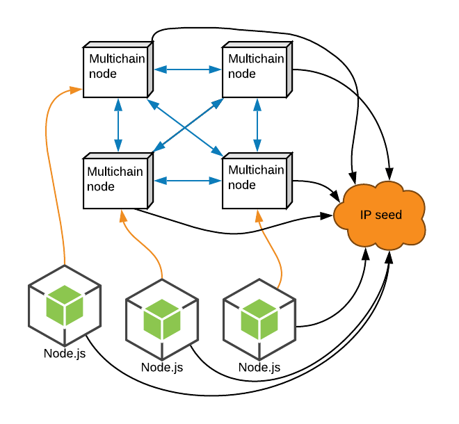

# Multichain Database

1. [Overview](#overview)
2. [System diagram](#system-diagram)
3. [Startup (how-to)](#startup)

### Overview <a name="overview"></a>
A simple implementation of [Multichain](https://www.multichain.com/) as a database behind a Node.js service.

The system utilizes an IP-seed which plays the role of a [DNS seed](https://bitcoin.org/en/glossary/dns-seed) as it is in the Bitcoin network, for example.

Once started, a Multichain node will request the IP-seed for an IP of a node of an existing network. If none returned, this means the current node is the root node. Any consecutive node, upon requesting the IP-seed, will get a random IP of a node which is already part of the network. With this IP, the new node will connect to the network and sync the existing data.

Once started, a Node.js app (or any other server app) will request the IP-seed for a random IP of a node from the Multichain (or Blockchain) network, to connect to and use as a Database. The Node.js app in this repo implements a repetetive mechanism that constantly checks for the availability of the node to which it's currently connected. Upon fialure, it will request a new node IP from the IP-seed.

For better understanding, see below.

### System diagram <a name="system-diagram"></a>


### Start up (how-to) <a name="startup"></a>
1. Navigate to the `ip-seed` dir and start the service: `npm start`
2. Navigate to to the `multichain-node` dir and start as many nodes as you want with `npm start node1`. The `docker-compose.yml` file contains definitions for 3 nodes, named `node1` to `node3`
3. Navigate to to the `multichain-app` dir and start as many services as you want using the command: 

	```
	npm start app1 // or app2 or app3
	```	
	
 The `docker-compose.yml` file contais definitions for 3 services, named `app1` to `app3`.
